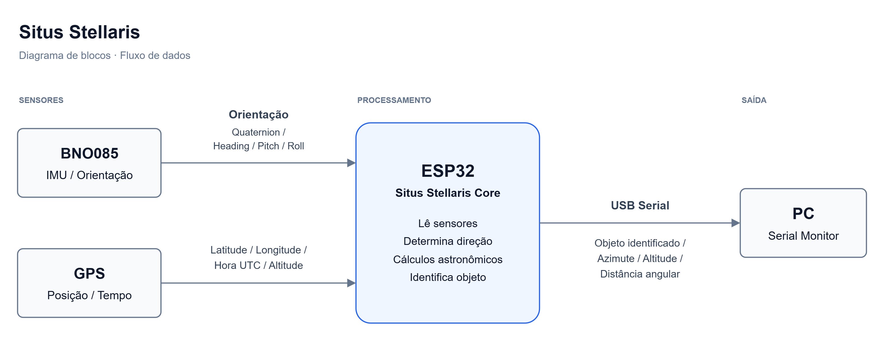

# Situs Stellaris

Localizador astronômico portátil baseado em **ESP32-S3**, **BNO085** e **GPS**, desenvolvido para relacionar a direção de apontamento do aparelho com a posição de estrelas no céu.

O projeto reúne eletrônica embarcada, orientação espacial e cálculos astronômicos. Os resultados serão apresentados no computador pelo **Serial Monitor**, por meio de uma conexão USB.

> **Em desenvolvimento:** o repositório contém o planejamento técnico e o diagrama de blocos. O firmware e os testes de bancada ainda não estão disponíveis neste repositório.

## Objetivo

Construir um protótipo capaz de obter sua posição geográfica, data, hora e orientação, calcular a posição aparente de estrelas de um pequeno catálogo local e comparar esses valores com a direção medida pelo aparelho.

A primeira validação descrita no manual consiste em **selecionar uma estrela e orientar o apontamento até ela**. O diagrama também prevê a identificação de um objeto a partir da direção apontada; essa funcionalidade ainda precisa ter seus critérios definidos e implementados.

## Como funciona

1. O **GPS** fornece latitude, longitude, altitude geográfica e data/hora UTC.
2. O **BNO085** fornece uma estimativa da orientação do sensor.
3. O **ESP32-S3** lê os sensores, consulta o catálogo local e executa os cálculos astronômicos.
4. O programa compara a direção apontada com a direção calculada para a estrela.
5. O **PC / Serial Monitor** apresenta o alvo, os resultados e o estado dos sensores.

O protótipo foi planejado para funcionar sem internet, Wi-Fi ou Bluetooth. O GPS recebe os sinais dos satélites, enquanto o USB fornece alimentação e comunicação com o computador.

## Diagrama de blocos



[Abrir o diagrama editável no formato draw.io](hardware/diagrams/situs-stellaris-diagram.drawio)

O diagrama apresenta o fluxo de dados. Os detalhes de montagem e as conexões elétricas estão descritos no manual técnico e precisam ser conferidos para os módulos utilizados.

## Componentes previstos

| Componente | Função | Interface planejada |
| --- | --- | --- |
| ESP32-S3 | Leitura dos sensores e processamento dos cálculos | SPI, UART e USB |
| BNO085 | Estimativa de orientação espacial | SPI com o ESP32-S3 |
| GPS NEO-6M ou NEO-M8N | Posição geográfica, data e hora UTC | UART com o ESP32-S3 |
| Computador | Alimentação USB e visualização dos resultados | USB / Serial Monitor |

Os modelos exatos das placas, a pinagem e as condições de alimentação devem ser registrados antes da montagem. As características de um módulo não são necessariamente iguais às da placa adaptadora em que ele está instalado.

## Resultados previstos

- Estrela selecionada e seu identificador no catálogo.
- Azimute e altitude angular calculados para o alvo.
- Direção de apontamento medida pelo aparelho.
- Distância angular entre a direção medida e o alvo.
- Indicação de ajuste do apontamento.
- Estado e idade das leituras do GPS e do BNO085.

**Altitude angular** é o ângulo acima do horizonte, expresso em graus. Ela é diferente da **altitude geográfica** fornecida pelo GPS, expressa em metros.

## Etapas de desenvolvimento

- [x] Elaborar o manual técnico e o roteiro de estudo.
- [x] Criar o diagrama de blocos e sua versão editável.
- [ ] Definir os critérios da identificação de objetos por apontamento.
- [ ] Configurar o projeto de firmware para o ESP32-S3.
- [ ] Registrar os módulos e validar as ligações do protótipo.
- [ ] Ler e validar a orientação fornecida pelo BNO085.
- [ ] Ler e validar posição, data e hora do GPS.
- [ ] Implementar detecção de dados inválidos ou desatualizados.
- [ ] Implementar um catálogo local com 5 a 10 estrelas.
- [ ] Implementar e testar os cálculos de azimute e altitude.
- [ ] Alinhar os eixos do sensor com a direção de apontamento e a referência de norte verdadeiro.
- [ ] Calcular a distância angular e as instruções de apontamento.
- [ ] Integrar os módulos e a saída no Serial Monitor.
- [ ] Realizar testes com estrelas conhecidas e registrar os erros medidos.

## Documentação e estrutura

```text
situs-stellaris/
├── README.md
├── LICENSE
├── docs/
│   └── manual-tecnico.md
└── hardware/
    └── diagrams/
        ├── situs-stellaris-diagrama-de-blocos.drawio
        ├── situs-stellaris-diagrama-de-blocos.png
        └── situs-stellaris-no-diagrams-net.png
```

O [manual técnico e guia de estudo](docs/manual-tecnico.md) reúne o roteiro de montagem, fundamentos matemáticos, convenções de coordenadas, exemplos de cálculo e critérios de validação.

## Como começar

1. Leia as seções de objetivos, componentes e arquitetura do manual técnico.
2. Confira o diagrama de blocos para entender o caminho dos dados.
3. Identifique as placas disponíveis e registre suas características e conexões.
4. Valide ESP32-S3, BNO085 e GPS separadamente antes de integrar os cálculos astronômicos.

As instruções de compilação, dependências e gravação serão adicionadas quando o firmware estiver disponível. Os exemplos e contratos de software do manual são referências de implementação, não um programa pronto para executar.

## Limites da primeira versão

O protótipo utiliza um pequeno catálogo de estrelas e saída pelo computador. Não prevê câmera, reconhecimento de imagens, motores de apontamento, tela dedicada ou bateria própria nesta etapa.

A precisão dependerá do alinhamento mecânico, da calibração, do ambiente magnético e das aproximações dos cálculos. Ela será avaliada em testes; ainda não há uma precisão validada para o conjunto.

## Contribuições

Sugestões e problemas podem ser registrados nas issues do repositório. Para relatar um teste, inclua os módulos utilizados, a versão do firmware, o resultado esperado e o resultado observado.

## Licença

Este projeto está disponível sob a [licença MIT](LICENSE).
